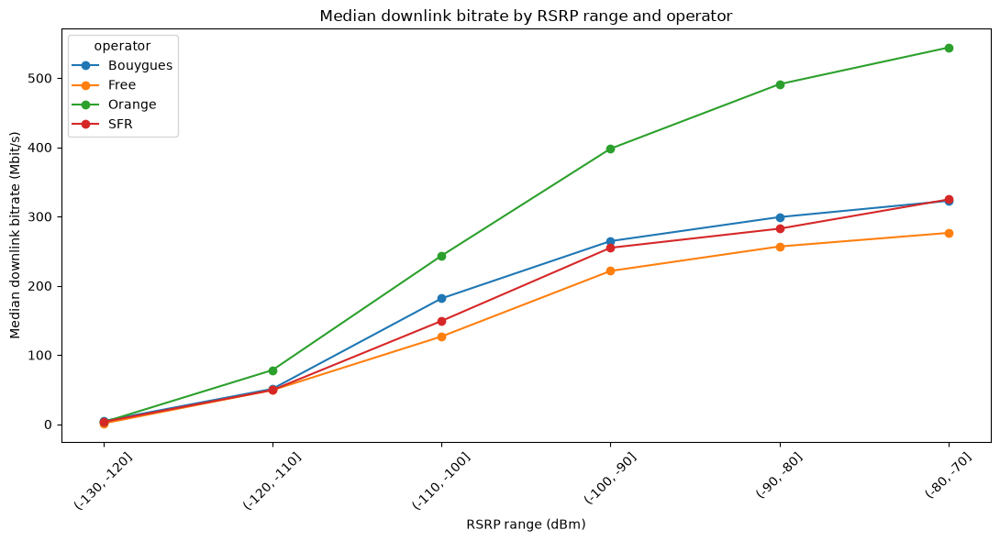
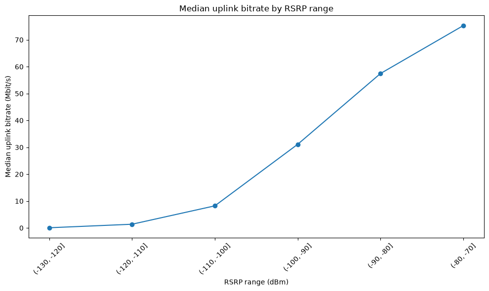
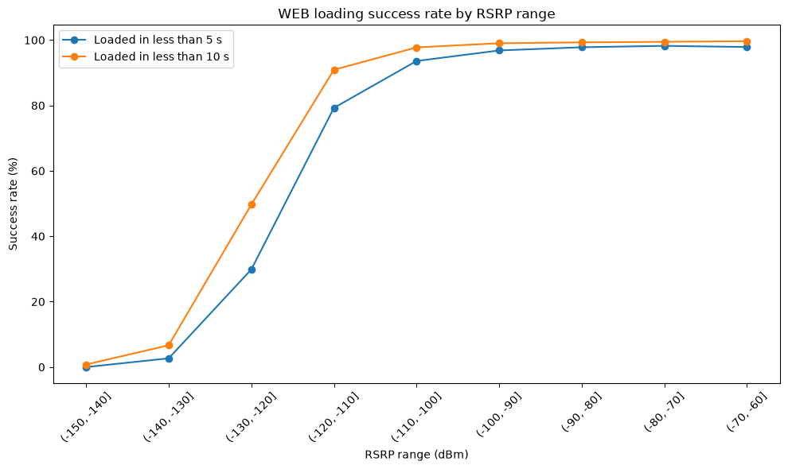
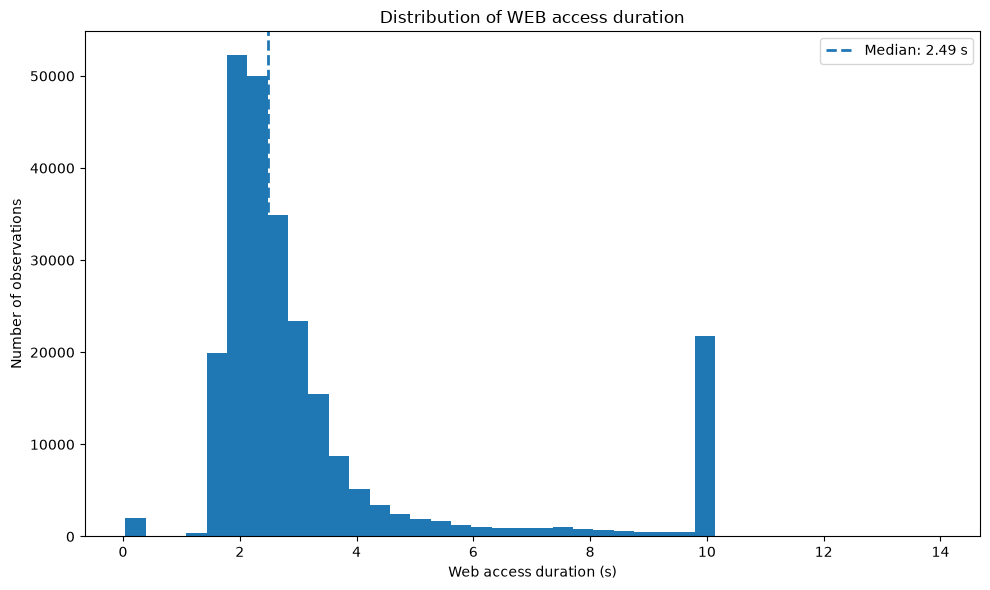

# France Mobile Network QoS Analysis

## Radio conditions, throughput and Quality of Experience

This project analyzes mobile network Quality of Service (QoS) measurements from the **ARCEP 2025 metropolitan France measurement campaign**.

The objective is to study how radio conditions — mainly **RSRP** and **RSRQ** — are associated with user-facing performance across several mobile-service scenarios:

- Downlink throughput
- Uplink throughput
- Web browsing performance
- Video streaming quality
- Upload reliability

The analysis also compares the four French mobile operators present in the dataset while keeping the interpretation campaign-specific and avoiding causal conclusions.

---

## Project objectives

The project follows an engineering-oriented QoS analysis workflow:

1. Inspect and clean the raw ARCEP dataset.
2. Assess data quality and missing values.
3. Analyze RSRP and RSRQ distributions.
4. Compare radio conditions across operators.
5. Study the relationship between radio conditions and downlink/uplink throughput.
6. Compare operator performance within comparable RSRP/RSRQ classes.
7. Analyze WEB Quality of Experience indicators.
8. Investigate STREAM quality indicators.
9. Analyze ULH upload reliability.
10. Document methodological limits and avoid over-interpreting observational data.

---

## Dataset

Source: **ARCEP Open Data — Mobile service quality measurements**

Dataset used:

`2025_QoS_Metropole_data_habitations.csv`

The raw dataset contains **354,282 observations and 103 columns** before cleaning.

The notebook preserves the original raw file and creates a separate processed dataset after removing unusable columns and preparing the variables required for the analysis.

### Official sources

- ARCEP Open Data — Mobile QoS measurements  
  https://data.arcep.fr/mobile/mesures_qualite_arcep/
- ARCEP Open Data — 2025 Metropolitan France dataset  
  https://data.arcep.fr/mobile/mesures_qualite_arcep/2025/Metropole/index.html
- ARCEP — 2025 mobile-service quality campaign  
  https://www.arcep.fr/actualites/actualites-et-communiques/detail/n/qualite-des-services-mobiles-en-metropole-201125.html
- ARCEP — Mobile-service quality  
  https://www.arcep.fr/la-regulation/grands-dossiers-reseaux-mobiles/la-qualite-des-services-mobiles.html

---

## Main indicators

### Radio measurements

- **RSRP — Reference Signal Received Power**
- **RSRQ — Reference Signal Received Quality**

### Throughput

- Downlink bitrate
- Uplink bitrate

### WEB

- Page loaded in less than 5 seconds
- Page loaded in less than 10 seconds
- Successful access duration
- Timeout behavior

### STREAM

- Correct quality
- Perfect quality

### ULH

- Upload success (`upload_ok`)

---

## Methodology

The analysis is protocol-specific because many QoS variables are populated only for their corresponding test protocol.

The main techniques used are:

- Missing-value analysis
- Descriptive statistics
- Operator-level comparisons
- RSRP classes of 10 dB
- RSRQ classes of 5 dB
- Median KPI analysis by radio class
- Pearson correlation
- Spearman rank correlation
- Binary success-rate analysis
- Visual masking of sparse groups

For some figures, groups with fewer than **100 observations** are hidden to reduce visual over-interpretation. This rule is used **only for visualization**: it is not a telecom standard, not a statistical significance threshold, and no underlying observations are deleted.

---

## Visual highlights

The repository includes selected figures so the main engineering results can be reviewed directly from GitHub without running the notebook.

### Downlink throughput at comparable RSRP levels



This view compares operator medians inside common RSRP classes rather than relying only on raw operator averages.

### Uplink throughput versus RSRP



The monotonic rise illustrates the strong association observed between RSRP and uplink throughput.

### WEB loading success and the plateau effect



WEB loading success improves rapidly as radio conditions move from weak to intermediate, then approaches a high-success plateau.

### WEB access-duration timeout signature



The concentration around 10 seconds is why timeout observations are treated separately instead of as ordinary continuous duration measurements.

---

## Key findings

### 1. Radio conditions and throughput

Radio conditions are positively associated with throughput.

For the full downlink sample:

- Spearman RSRP vs DL bitrate: approximately **0.56**
- Spearman RSRQ vs DL bitrate: approximately **0.37**

The relationship is therefore stronger for RSRP than for RSRQ in the observed DL measurements.

### 2. Uplink throughput is strongly associated with RSRP

The uplink analysis shows a substantially stronger monotonic relationship:

- Spearman RSRP vs UL bitrate: approximately **0.85**

This strong relationship is also observed consistently across the four operators.

### 3. Operator comparisons require comparable radio conditions

Raw operator averages can mix different radio environments.

The notebook therefore also compares operators **inside common RSRP and RSRQ classes**, allowing a more meaningful descriptive comparison while still acknowledging that other technical conditions are not controlled.

### 4. WEB performance shows a transition-and-plateau pattern

WEB loading success improves sharply as radio conditions improve and then reaches a high-success plateau.

A specific data-quality issue was identified for access duration: many timeout observations are concentrated close to **10 seconds**. Access-duration analysis is therefore performed separately on successful tests rather than treating the timeout value as an ordinary continuous measurement.

### 5. STREAM quality improves with radio conditions

`quality_correct` and `quality_perfect` are strongly nested indicators.

Their success rates improve with RSRP and RSRQ before reaching a plateau under more favorable radio conditions.

### 6. ULH upload reliability follows the same general pattern

Observed ULH success rates vary by operator and increase with stronger radio conditions.

Across the campaign sample, operator upload-success rates are approximately **86% to 93%**.

---

## Important limitations

This is an **observational analysis**.

The results describe the ARCEP measurement campaign and must not be interpreted as a universal ranking of mobile operators.

In particular:

- Correlation does not imply causation.
- Measurements depend on locations, dates, devices, protocols and network state.
- Radio measurements explain only part of end-to-end performance.
- Spectrum, scheduler behavior, load, interference, MIMO conditions, device capability, transport/core network and remote servers may also affect QoS.
- Sample sizes differ strongly between protocols.
- Operator comparisons remain campaign-specific even when performed within the same radio-quality classes.

---

## Repository structure

```text
France-Mobile-Network-QoS-Analysis/
│
├── data/
│   ├── raw/
│   │   └── 2025_QoS_Metropole_data_habitations.csv
│   └── processed/
│       └── 2025_QoS_Metropole_data_habitations_clean.csv
│
├── notebooks/
│   └── radio_qos_analysis.ipynb
│
├── reports/
│   └── figures/
│
├── README.md
├── requirements.txt
├── LICENSE
└── .gitignore
```

The raw and processed CSV files are intentionally excluded from Git by default because of their size. Download the source dataset from ARCEP and place it in `data/raw/`.

---

## Installation

Clone the repository:

```bash
git clone <repository-url>
cd France-Mobile-Network-QoS-Analysis
```

Create a virtual environment:

### Windows

```bash
python -m venv .venv
.venv\Scripts\activate
```

### macOS / Linux

```bash
python -m venv .venv
source .venv/bin/activate
```

Install the dependencies:

```bash
pip install -r requirements.txt
```

Then open the notebook in VS Code or Jupyter and run all cells from top to bottom.

---

## Reproducibility

The notebook uses project-relative paths:

```text
../data/raw/
../data/processed/
```

To reproduce the analysis:

1. Download the ARCEP 2025 metropolitan dataset.
2. Place `2025_QoS_Metropole_data_habitations.csv` in `data/raw/`.
3. Activate the Python environment.
4. Install `requirements.txt`.
5. Run the portfolio notebook from the `notebooks/` directory.
6. Verify that the notebook runs from a clean kernel without errors.

---

## Tools

- Python
- Pandas
- Matplotlib
- SciPy
- Jupyter / VS Code

---

## Author

**Daouda Barry**  
Telecommunications / Radio Network Engineering
